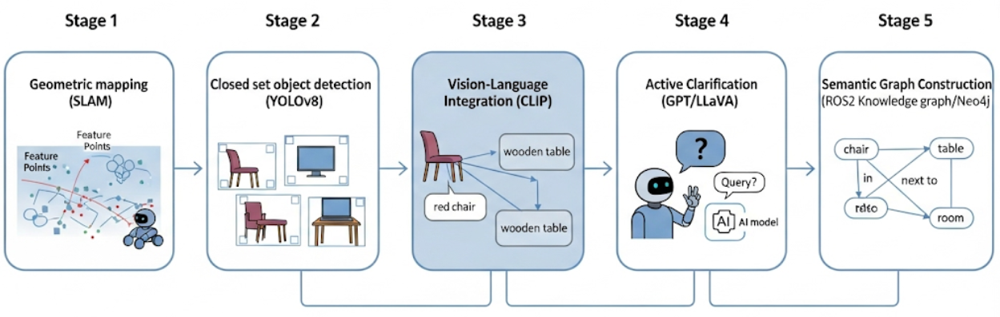

# Autonomous Navigation + YOLO VLM Semantic Mapping (ri_pkg)

This package delivers a full TurtleBot3 exploration stack that combines Nav2-based autonomous navigation, a YOLO + Vision-Language (VLM) perception pipeline, and a human-in-the-loop clarification workflow. The robot navigates through configurable waypoints, detects objects, and pauses when confidence is low so that an operator can confirm or relabel the detection.

<p align="center">
  
</p>

---

## 🎥 Demo Videos

### Gazebo Simulation Demo

Watch the autonomous navigation and semantic mapping system in action in Gazebo simulation:

https://github.com/user-attachments/assets/final_gazebo_demo.mp4

<video src="assets/demo videos/final_gazebo_demo.mp4" controls width="100%"></video>

[📥 Download Simulation Demo Video](assets/demo%20videos/final_gazebo_demo.mp4)

### Real Hardware Demo (TurtleBot3 Waffle Pi)

Watch the system running on the actual TurtleBot3 Waffle Pi robot:

https://github.com/user-attachments/assets/final_ri_demo.mp4

<video src="assets/demo videos/final ri demo.mp4" controls width="100%"></video>

[📥 Download Hardware Demo Video](assets/demo%20videos/final%20ri%20demo.mp4)

---

## 📚 Documentation

- **[SETUP.md](SETUP.md)** - Complete installation guide for first-time setup
- **[QUICK_START.md](QUICK_START.md)** - Quick reference for running the system
- **[commands.md](commands.md)** - Extended command reference and advanced usage
- **README.md** (this file) - System architecture, features, and detailed documentation

---

## Table of Contents

- [Device Specs](#device-specs)
- [Prerequisites](#prerequisites)
  - [ROS 2 Jazzy Installation](#ros-2-jazzy-installation)
  - [Setting Up Gazebo and TurtleBot3 Workspace](#setting-up-gazebo-and-turtlebot3-workspace)
- [Repository Setup](#repository-setup)
- [Features](#features)
- [System Architecture](#system-architecture)
- [Folder Structure](#folder-structure)
- [Dependency Installation](#dependency-installation)
- [Building the Workspace](#building-the-workspace)
- [Running the Stack](#running-the-stack)
  - [Terminal Setup Overview](#terminal-setup-overview)
  - [Terminal 1: Gazebo Simulation](#terminal-1-gazebo-simulation)
  - [Terminal 2: Navigation2](#terminal-2-navigation2)
  - [Terminal 3: Perception (YOLO + VLM)](#terminal-3-perception-yolo--vlm)
  - [Terminal 4: Autonomous Navigation](#terminal-4-autonomous-navigation)
  - [Terminal 5 (Optional): Camera Viewer](#terminal-5-optional-camera-viewer)
- [Human-in-the-Loop Clarification Flow](#human-in-the-loop-clarification-flow)
- [Expected Inputs & Outputs](#expected-inputs--outputs)
- [Troubleshooting](#troubleshooting)

## Device Specs

**Recommended System Requirements:**

- **OS:** Linux Ubuntu 24.04.3 (Noble Numbat) - for ROS2 Jazzy Jalisco
- **Kernel Version:** Linux 6.14.0-32-generic
- **Processor:** 12th Gen Intel® Core™ i7-12700H × 20
- **Memory:** 16 GB
- **GPU:** NVIDIA GeForce RTX™ 3050 Ti Laptop GPU (Install GPU drivers for Linux)
  - *A dedicated GPU is very much recommended for running 3D simulators like Gazebo*
- **Windowing System:** X11 (64 bit)

## Prerequisites

### ROS 2 Jazzy Installation

Follow the official ROS 2 Jazzy installation and tutorials:

- [Installation — ROS 2 Documentation: Jazzy documentation](https://docs.ros.org/en/jazzy/Installation.html)
- [Tutorials - Jazzy documentation](https://docs.ros.org/en/jazzy/Tutorials.html)
- [Using turtlesim, ros2, and rqt — ROS 2 Documentation: Jazzy documentation](https://docs.ros.org/en/jazzy/Tutorials/Beginner-CLI-Tools/Introducing-Turtlesim/Introducing-Turtlesim.html)

### Setting Up Gazebo and TurtleBot3 Workspace

Follow these steps in order and make sure to complete every single step without skipping anything:

**IMPORTANT:** In the below links, make sure to change the ROS version to Jazzy at the top of the page.

1. [Quick Start Guide](https://emanual.robotis.com/docs/en/platform/turtlebot3/quick-start/)
2. [TurtleBot3 Simulation](https://emanual.robotis.com/docs/en/platform/turtlebot3/simulation/)
3. [SLAM Simulation](https://emanual.robotis.com/docs/en/platform/turtlebot3/slam_simulation/)
4. [Navigation Simulation - TurtleBot3](https://emanual.robotis.com/docs/en/platform/turtlebot3/nav_simulation/)

After completing the above setup, you should have a turtlebot workspace with these 4 directories inside the `src` directory:

```text
/home/akshat/turtlebot3_ws/src/DynamixelSDK
/home/akshat/turtlebot3_ws/src/turtlebot3
/home/akshat/turtlebot3_ws/src/turtlebot3_msgs
/home/akshat/turtlebot3_ws/src/turtlebot3_simulations
```

## Repository Setup

Once you have the TurtleBot3 workspace set up, clone this repository into the `src` directory:

```bash
cd ~/turtlebot3_ws/src
git clone <your-repo-url> ri_pkg
```

Your workspace structure should now include the `ri_pkg` directory alongside the TurtleBot3 packages.

## Features

- **Nav2-driven autonomous exploration** with configurable waypoint sequences and recovery behaviors.
- **YOLO + VLM semantic mapping** that logs detections, world coordinates, and descriptive metadata.
- **Human-in-the-loop confirmation** whenever detection confidence drops below the configured threshold.
- **Persistence and resume support** via JSON logs for navigation progress, detections, and human clarifications.
- **Convenience launchers (`run.sh`, `run.py`)** to orchestrate navigation and perception pipelines.

## System Architecture

```text
Gazebo / Real Robot (Hardware)
    ├──> /scan (LaserScan)  ─┐
    ├──> /odom (Odometry)    ├──> Autonomous Navigation Node (autonomous_navigation_node.py)
    └──> /camera/image_raw/compressed ─┘  │
                                          │ publishes /cmd_vel, /exploration_active
                                          │ samples perception /yolo/detection_result
                                          └── pause/resume control + human clarification prompts

YOLO + VLM Node (perception_waffle.py or perception_internvl.py)
    ├──> Subscribes to /camera/image_raw/compressed, /odom, /scan
    └──> Publishes detection results to /yolo/detection_result, writes JSON logs

Human Operator Interface
    └──> Receives OpenCV window + console prompt when clarification is required
         (supports voice input via ElevenLabs STT if configured)

Persistent Data
    ├── navigation_waypoints.json (progress + resume)
    ├── detected_objects_map.json (semantic map)
    └── human_clarification.json (confirmed labels & confidences)
```

**Key Differences Between Perception Scripts:**

- **`perception_waffle.py`**: Designed for real hardware (TurtleBot3 Waffle Pi) with compressed image topics
- **`perception_internvl.py`**: Optimized for Gazebo simulation with InternVL 3.5 1B model

## Folder Structure

```text
ri_pkg/
├── launch/
│   ├── autonomous_navigation.launch.py   # Starts navigation node
│   └── camera_subscriber.launch.py       # Optional camera viewer
├── ri_pkg/
│   ├── autonomous_navigation_node.py     # Nav2 client, human-in-loop logic
│   ├── perception_waffle.py              # YOLO + InternVL for hardware (compressed images)
│   ├── perception_internvl.py            # YOLO + InternVL for Gazebo simulation
│   ├── camera_subscriber.py              # Optional image viewer
│   ├── coordinate_mapping.py             # World-coordinate utilities
│   ├── tts_node.py                       # Text-to-speech support (ElevenLabs)
│   └── stt_node.py                       # Speech-to-text support (ElevenLabs)
├── assets/
│   ├── navigation_waypoints.json         # Persisted waypoint progress
│   ├── human_clarification.json          # Saved human confirmation records
│   ├── detected_objects_map.json         # Semantic map output
│   └── exploration_report.json           # Summary report after completion
├── run.sh                                # Bash launcher for the full stack
├── requirements.txt                      # Python dependencies for perception
├── commands.md                           # Extended launch recipes
├── setup.py                              # ROS 2 package setup
├── package.xml                           # ROS 2 package manifest
└── README.md                             # You are here
```

## Dependency Installation

### System Packages

Install system dependencies:

```bash
# FFmpeg for audio processing (required for speech features)
sudo apt-get update
sudo apt-get install ffmpeg
```

### Python Virtual Environment Setup

Create a dedicated Python virtual environment for perception nodes:

```bash
# Create virtual environment
python3 -m venv ~/yolo_clip_env

# Activate the environment
source ~/yolo_clip_env/bin/activate

# Upgrade pip
pip install --upgrade pip wheel

# Install all Python dependencies
cd ~/turtlebot3_ws/src/ri_pkg
pip install -r requirements.txt

# Install additional audio processing library
pip install pydub

# Deactivate for now (you'll reactivate when running perception nodes)
deactivate
```

**Note:** The `requirements.txt` includes:
- `ultralytics` - YOLOv8/v10 object detection
- `transformers` - InternVL 3.5 VLM model
- `torch`, `torchvision` - Deep learning framework
- `opencv-python` - Computer vision
- `sounddevice`, `pyttsx3` - Audio I/O for speech features
- And many more dependencies for the perception pipeline

### ROS 2 Dependencies

Install ROS 2 package dependencies:

```bash
cd ~/turtlebot3_ws
source /opt/ros/jazzy/setup.bash
rosdep install --from-paths src --ignore-src -r -y
```

## Building the Workspace

Build the workspace with colcon:

```bash
cd ~/turtlebot3_ws
source /opt/ros/jazzy/setup.bash
colcon build --packages-select ri_pkg
source install/setup.bash
```

**Verify the build:**

```bash
# Check if ri_pkg executables are available
ros2 pkg list | grep ri_pkg

# Should show: ri_pkg
```

## Running the Stack

The system requires **4-5 terminals** running simultaneously. Each terminal handles a specific component of the system.

### Terminal Setup Overview

1. **Terminal 1:** Gazebo simulation (or connect to real hardware)
2. **Terminal 2:** Navigation2 stack with map
3. **Terminal 3:** Perception (YOLO + VLM) - choose hardware or simulation version
4. **Terminal 4:** Autonomous navigation controller
5. **Terminal 5 (Optional):** Camera feed viewer

### Terminal 1: Gazebo Simulation

Launch the TurtleBot3 house simulation:

```bash
# Source ROS 2
source /opt/ros/jazzy/setup.bash

# Set TurtleBot3 model
export TURTLEBOT3_MODEL=waffle_pi

# Launch Gazebo with house world
ros2 launch turtlebot3_gazebo turtlebot3_house.launch.py use_sim_time:=True
```

**For Real Hardware:** Skip this terminal and connect to your physical TurtleBot3.

### Terminal 2: Navigation2

Launch Navigation2 with your pre-generated map:

```bash
# Source ROS 2 and workspace
source /opt/ros/jazzy/setup.bash
source ~/turtlebot3_ws/install/setup.bash

# Launch Navigation2
ros2 launch turtlebot3_navigation2 navigation2.launch.py use_sim_time:=True map:=$HOME/map_house.yaml
```

**Important:**
- Make sure you have created a map using SLAM beforehand (see TurtleBot3 SLAM tutorials)
- The map file path should point to your saved map YAML file
- In RViz, use the "2D Pose Estimate" button to initialize the robot's position

### Terminal 3: Perception (YOLO + VLM)

Choose the appropriate perception script based on your setup:

#### For Hardware (TurtleBot3 Waffle Pi):

```bash
# Source ROS 2 and workspace
source /opt/ros/jazzy/setup.bash
source ~/turtlebot3_ws/install/setup.bash

# Activate Python environment
source ~/yolo_clip_env/bin/activate

# Run perception for hardware
python3 ~/turtlebot3_ws/src/ri_pkg/ri_pkg/perception_waffle.py
```

#### For Simulation (Gazebo):

```bash
# Source ROS 2 and workspace
source /opt/ros/jazzy/setup.bash
source ~/turtlebot3_ws/install/setup.bash

# Activate Python environment
source ~/yolo_clip_env/bin/activate

# Run perception for simulation
python3 ~/turtlebot3_ws/src/ri_pkg/ri_pkg/perception_internvl.py
```

**What this does:**
- Subscribes to camera, odometry, and LiDAR topics
- Runs YOLO object detection
- Uses InternVL 3.5 VLM for semantic labeling
- Publishes detections to `/yolo/detection_result`
- Saves detected objects to `detected_objects_map.json`
- Shows annotated video feed with bounding boxes

### Terminal 4: Autonomous Navigation

Run the autonomous navigation controller:

```bash
# Source ROS 2 and workspace
source /opt/ros/jazzy/setup.bash
source ~/turtlebot3_ws/install/setup.bash

# Activate Python environment (needed for human clarification features)
source ~/yolo_clip_env/bin/activate

# Run autonomous navigation
python3 ~/turtlebot3_ws/src/ri_pkg/ri_pkg/autonomous_navigation_node.py
```

**What this does:**
- Navigates through predefined waypoints sequentially
- Monitors perception results for low-confidence detections
- Pauses navigation when human clarification is needed
- Saves navigation progress to `navigation_waypoints.json`
- Generates exploration report upon completion

### Terminal 5 (Optional): Camera Viewer

View the raw camera feed without annotations:

```bash
# Source ROS 2 and workspace
source /opt/ros/jazzy/setup.bash
source ~/turtlebot3_ws/install/setup.bash

# Activate Python environment
source ~/yolo_clip_env/bin/activate

# Run camera subscriber
python3 ~/turtlebot3_ws/src/ri_pkg/ri_pkg/camera_subscriber.py
```

Press `q` in the camera window to quit the viewer.

## Human-in-the-Loop Clarification Flow

1. YOLO+VLM publishes detections to `/yolo/detection_result`.
2. `autonomous_navigation_node` evaluates confidence scores. If a detection is below the threshold and the label has not been confirmed before, it:
   - Cancels the current navigation goal and stops the robot.
   - Freezes the latest RGB frame, draws the bounding box, and displays it in an OpenCV window.
   - Prompts the operator in the console to confirm or provide the actual label.
3. The chosen label is logged to `human_clarification.json` with the detection metadata. Future detections with the same label or signature are ignored.
4. Navigation automatically resumes after the clarification is recorded.

## Expected Inputs & Outputs

### Inputs

**ROS Topics:**

- `/odom` - Robot odometry (position and orientation)
- `/scan` - LiDAR laser scan data
- `/camera/image_raw/compressed` - Compressed camera images (hardware)
- `/camera/color/image_raw` - Raw camera images (simulation, depending on setup)
- `/yolo/detection_result` - Published by perception node

**Configuration Files:**

- `assets/navigation_waypoints.json` - Waypoint sequence and progress tracking
- YOLO model weights: `yolov8s.pt` or `yolov10s.pt` (should be in workspace root or specified path)

**Human Input:**

- Console text input or voice input (via ElevenLabs STT) when low-confidence detection occurs

### Outputs

**ROS Topics:**

- `/cmd_vel` - Velocity commands to control the robot
- `/exploration_active` - Boolean flag indicating if exploration is active
- `/yolo/detection_result` - Detection results with labels, confidence, coordinates

**Data Files (saved in `assets/` directory):**

- `detected_objects_map.json` - Complete semantic map with all detected objects
  - Includes: object ID, label, confidence, world coordinates, timestamp
  
- `human_clarification.json` - Human-confirmed object labels
  - Includes: detected label, actual label, confidence, coordinates, bbox
  
- `navigation_waypoints.json` - Navigation progress and waypoint status
  - Includes: visited waypoints, current index, completion status
  
- `exploration_report.json` - Summary report generated after exploration completes
  - Includes: total waypoints, successful/failed counts, timing information

**Visual Outputs:**

- OpenCV windows showing:
  - Annotated camera feed with bounding boxes and labels
  - Low-confidence detection frames during human clarification
  - Optional raw camera feed (camera_subscriber.py)

## Troubleshooting

### Common Issues and Solutions

#### 1. "Nav2 action server not available"

**Problem:** Navigation node can't connect to Nav2.

**Solution:**
- Make sure Terminal 2 (Navigation2) is running
- Check if Nav2 launched successfully: `ros2 node list` should show navigation nodes
- Verify map file exists: `ls -l ~/map_house.yaml`

#### 2. "Robot pose not available"

**Problem:** Autonomous navigation can't get robot position.

**Solution:**
- Check if `/odom` topic is publishing: `ros2 topic echo /odom`
- In RViz, use "2D Pose Estimate" button to initialize robot location
- Verify robot is properly localized on the map

#### 3. "No camera frame in clarification window"

**Problem:** Human clarification window shows no image.

**Solution:**
- Confirm camera topic is publishing: `ros2 topic list | grep camera`
- Check if perception node (Terminal 3) is running
- For hardware: verify compressed image topic exists: `ros2 topic info /camera/image_raw/compressed`
- For simulation: check if Gazebo camera sensor is active

#### 4. "VLM node fails to start" or "CUDA out of memory"

**Problem:** Perception script crashes or GPU memory error.

**Solution:**
- Ensure you have NVIDIA GPU drivers installed: `nvidia-smi`
- Check available GPU memory: `nvidia-smi` (should show free memory)
- For limited GPU memory: Edit perception script to use smaller model or lower resolution
- Verify PyTorch CUDA is available: `python3 -c "import torch; print(torch.cuda.is_available())"`

#### 5. "Module not found" errors in Python scripts

**Problem:** Missing Python dependencies.

**Solution:**
```bash
source ~/yolo_clip_env/bin/activate
pip install -r ~/turtlebot3_ws/src/ri_pkg/requirements.txt
pip install pydub  # If audio features needed
```

#### 6. "Navigation goal rejected by Nav2"

**Problem:** Robot won't navigate to waypoint.

**Solution:**
- Initialize robot pose in RViz using "2D Pose Estimate"
- Check if goal pose is valid on the map (not in obstacle or unknown area)
- Clear costmaps: `ros2 service call /global_costmap/clear_entirely_global_costmap std_srvs/srv/Empty`

#### 7. Repeated prompts for the same object

**Problem:** System keeps asking for clarification on already-confirmed objects.

**Solution:**
- Check that `assets/human_clarification.json` exists and is writable
- Verify file permissions: `ls -l ~/turtlebot3_ws/src/ri_pkg/assets/`
- Check if file is being updated: Monitor file modification time while running

#### 8. "Failed to load objects: JSON corrupted"

**Problem:** Detection or waypoint JSON files are corrupted.

**Solution:**
```bash
cd ~/turtlebot3_ws/src/ri_pkg/assets
# Backup existing files
mv detected_objects_map.json detected_objects_map.json.backup
mv navigation_waypoints.json navigation_waypoints.json.backup
# Files will be recreated on next run
```

#### 9. Poor detection accuracy

**Problem:** Objects are misidentified or confidence is always low.

**Solution:**
- Ensure good lighting in simulation or real environment
- Try different YOLO model: Edit script to use `yolov8n.pt` (faster) or `yolov8x.pt` (more accurate)
- Adjust confidence threshold in `autonomous_navigation_node.py`: Change `LOW_CONFIDENCE_THRESHOLD`
- For simulation: Increase camera quality in Gazebo world file

#### 10. Robot doesn't move

**Problem:** Robot is stuck or not responding to navigation commands.

**Solution:**
- Check if `/cmd_vel` topic is being published: `ros2 topic hz /cmd_vel`
- Verify robot is not in recovery behavior (spinning in place)
- Check for obstacles in costmap (view in RViz)
- Restart navigation: Kill Terminal 4 and restart autonomous navigation node

### Getting More Help

- Check the detailed commands in `commands.md` for advanced configurations
- View ROS 2 logs: `ros2 run rqt_console rqt_console`
- Monitor topics: `ros2 topic list` and `ros2 topic echo <topic_name>`
- For TurtleBot3 specific issues, consult: [ROBOTIS e-Manual](https://emanual.robotis.com/docs/en/platform/turtlebot3/overview/)

### Performance Tips

1. **For faster navigation:** Reduce `pause_duration` in `autonomous_navigation_node.py`
2. **For better detection:** Use GPU acceleration and ensure CUDA is properly configured
3. **For resource-constrained systems:** Use smaller YOLO model (`yolov8n.pt`) and lower camera resolution
4. **For simulation:** Adjust Gazebo real-time factor if simulation runs slowly

---

For extended command sequences and additional utilities, see `commands.md` in this directory.
